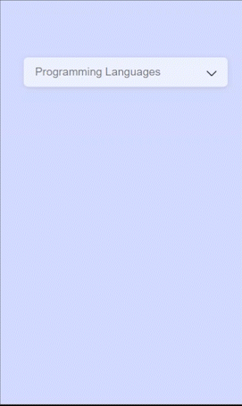

# Dropdown-Menu

It is a dropdown menu project which was created using ReactJs. An array of options containing objects is passed to the DropdownMenu component as props, which are added to the UI using the Map method.

### Hosted link: [Dropdown Menu](https://rahul4019.github.io/Dropdown-menu/)



## Installation

Clone the project and run the below command in the terminal to install all required dependencies.

```bash
npm install
```

## Run project

Run the project using the below command.

```bash
npm start
```

## Tools used

- HTML
- CSS
- JavaScript
- ReactJS

### Functionality

- Hover on the title to expand the menu
- click on the menu item to select it

### Functions (in code)

- handleMouseOver
- hanldeMouseLeave
- handleOptionClick
